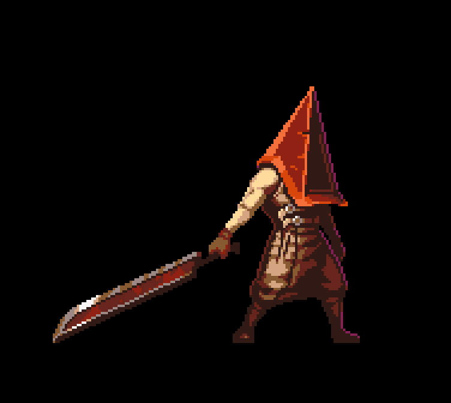
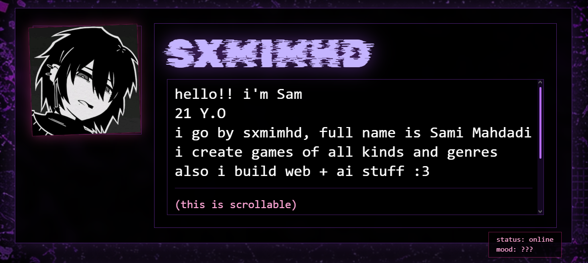
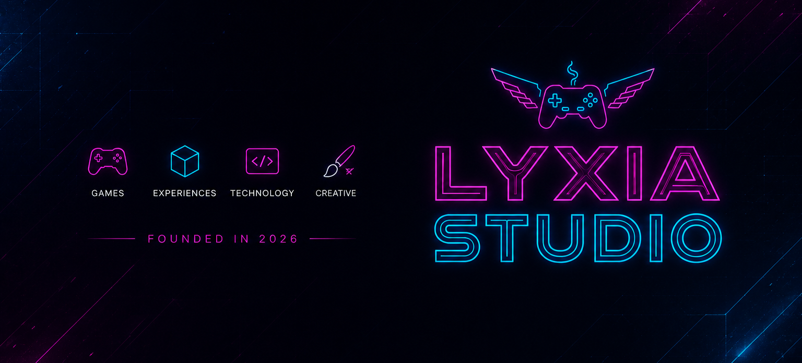

  

<h1 align="center"> Hey, I'm Sam </h1>
<h3 align="center">AI Engineer • Game Developer • Full-Stack Developer</h3>

Building intelligent systems, immersive games, and modern web applications.

---
<table>
<tr>

<td valign="top" width="33%">

<h2 align="center">🤖 AI Engineering</h2>

<h4>Machine Learning</h4>

<ul>
<li>Data Analysis & Visualization</li>
<li>SQL Analytics</li>
<li>Feature Engineering</li>
<li>Regression & Classification</li>
<li>Clustering & Segmentation</li>
<li>Recommendation Systems</li>
<li>Model Evaluation</li>
</ul>

<h4>Deep Learning</h4>

<ul>
<li>Neural Networks</li>
<li>Computer Vision</li>
<li>Natural Language Processing</li>
<li>Transfer Learning</li>
<li>PyTorch Development</li>
</ul>

<h4>Generative AI</h4>

<ul>
<li>Large Language Models (LLMs)</li>
<li>Vision Language Models (VLMs)</li>
<li>Retrieval-Augmented Generation (RAG)</li>
<li>Semantic Search</li>
<li>Embeddings & FAISS</li>
<li>AI Agents & Tool Calling</li>
<li>Prompt Engineering</li>
<li>Local AI Applications</li>
<li>AI Automation</li>
</ul>

<h4>Technologies</h4>

</td>

<td valign="top" width="33%">

<h2 align="center">🎮 Game Development</h2>

<h4>Engines</h4>

<ul>
<li>Unity (C#)</li>
<li>Unreal Engine (Blueprints & C++)</li>
</ul>

<h4>Gameplay Programming</h4>

<ul>
<li>Game Architecture</li>
<li>Gameplay Systems</li>
<li>Dialogue Systems</li>
<li>Inventory Systems</li>
<li>Quest Systems</li>
<li>Save & Load Systems</li>
<li>AI Behaviors</li>
<li>State Machines</li>
<li>Physics Programming</li>
</ul>

<h4>Development</h4>

<ul>
<li>2D & 3D Development</li>
<li>UI Systems</li>
<li>Performance Optimization</li>
<li>WebGL Deployment</li>
<li>Pixel Art Workflow</li>
</ul>

<h4>Technologies</h4>

</td>

<td valign="top" width="33%">

<h2 align="center">🌐 Full Stack Development</h2>

<h4>Frontend</h4>

<ul>
<li>React</li>
<li>TypeScript</li>
<li>JavaScript</li>
<li>Vite</li>
<li>Tailwind CSS</li>
<li>Responsive UI / UX</li>
</ul>

 

<h4>Backend</h4>

<ul>
<li>Node.js</li>
<li>Express.js</li>
<li>Laravel</li>
<li>REST APIs</li>
<li>Authentication Systems</li>
<li>Payment Integration</li>
</ul>

 

<h4>Databases</h4>

<ul>
<li>PostgreSQL</li>
<li>MySQL</li>
<li>SQLite</li>
</ul>

 

<h4>Development Tools</h4>

<ul>
<li>Git & GitHub</li>
<li>Docker</li>
<li>VS Code</li>
<li>Visual Studio</li>
</ul>

<h4>Technologies</h4>

</td>

</tr>
</table>

---

# 💼 What I Build

I enjoy building intelligent software that combines Artificial Intelligence, Game Development, and Modern Web Technologies.

My work ranges from data-driven machine learning solutions and autonomous AI agents to immersive games and scalable full-stack applications. I focus on writing clean, maintainable, and production-oriented software while continuously exploring emerging AI technologies.

---
<table align="center" cellspacing="0" cellpadding="0">
<tr>
<td align="center">

<h3>💼 Personal Portfolio</h3>

</td>

<td width="12"></td>

<td align="center">

<h3>🎮 Lyxia Studio</h3>

</td>
</tr>
</table>
